<div align="center">


# ALQQ · AI 自媒体内容运营平台

### 一次创作，多平台分发 · Windows 桌面端 2.1.0

从选题、写作和配图，到多账号发布与定时计划，在一个工作台完成。

[](#-使用与费用)
[](#-支持的平台)
[](https://github.com/zhuixin8/meiti-ai/releases/tag/v2.1.0)
[](LICENSE)

### 📥 [下载 Windows 桌面端 2.1.0](https://github.com/zhuixin8/meiti-ai/releases/download/v2.1.0/ALQQ_2.1.0_x64-setup.exe) ｜ [官网备用下载](https://www.alqq.cn/api/v1/desktop/download)

Windows 10 / 11 x64 · 约 166.7 MiB · [更新与校验说明](RELEASE-2.1.0.md)

[官网](https://www.alqq.cn/) · [免费注册](https://www.alqq.cn/register) · [功能介绍](#-主要功能) · [交流与反馈](#-交流与反馈)

</div>

---

## 💡 ALQQ 能做什么

**ALQQ** 为个人创作者、内容工作室和品牌运营团队提供内容创作与多平台发布工具。你可以根据热点或自己的选题生成文章，结合产品资料和知识库配图、调整文风，再把文章、动态发布到选定账号；界面中的视频发布入口统一在 Windows 桌面端使用。

Windows 桌面端使用你的电脑和网络完成浏览器发布；网页端方便管理内容、账号与计划；Linux 执行节点适合需要长期在线的自托管任务。三种方式共用 ALQQ 账号和业务数据。

### 开始使用

1. [注册 ALQQ 账号](https://www.alqq.cn/register)，下载并登录桌面端，或先使用网页端。
2. 在「账号管理」中添加平台账号，并按页面提示完成扫码或浏览器登录。
3. 配置自己的 AI / 图片服务，或使用套餐允许的平台资源；创建内容、检查预览后，选择账号发布。

注册和下载不需要添加微信。需要帮助时，可通过文末的交流群反馈。

---

## 🆕 桌面端 2.1.0

这一版更新了品牌图标和登录界面，也让更多图片与 AI 请求在用户电脑上处理。官网与 GitHub 提供同一份安装包。

| 升级点 | 说明 |
|---|---|
| **新的桌面体验** | 统一品牌图标，重新设计登录界面 |
| **利用本机网络** | 桌面端在线时，受支持的自有 AI / 图片服务请求可在本机执行 |
| **本地图片与草稿** | 支持图片处理、缓存与草稿恢复，自动清理过期缓存并保留仍被使用的素材 |
| **更清楚的发布进度** | 展示等待桌面上线、电脑忙碌、同账号任务占用等原因 |
| **更稳妥的结果处理** | 改进发布结果核查、防重复提交，以及 AI 试写、生成取消和作品同步 |

**系统要求**：Windows 10 / 11 x64。安装包包含发布所需运行环境；缺少 Microsoft WebView2 时，请按安装器提示安装。桌面端不支持 Windows 7 / 8。

**已有用户升级**：保存编辑、等待发布任务结束，再通过「设置 → 关于 → 检查更新」或运行完整安装包升级。**2.1.0 需要完整升级，旧版内容热更新不能替代安装包**。无需先卸载旧版，请保留用户数据目录。

普通用户下载 `.exe` 即可。详细更新日志、签名与文件校验方法见 [2.1.0 发布说明](RELEASE-2.1.0.md)。

---

## 🐳 Linux / 宝塔执行节点

不想让 Windows 电脑长期挂机时，可以在自己的 Linux 服务器或宝塔 Docker 中安装执行节点。先在 Windows 桌面端完成平台账号登录，再将支持托管的账号绑定到节点。通过 OpenAPI 发布远程视频直链的条件见下方「开放 API」。

账号、计划、内容与日志统一在 [ALQQ 主站](https://www.alqq.cn/) 管理；节点需要对应套餐或授权。

当前版本：[**Edge 1.1.5**](https://github.com/zhuixin8/meiti-ai/releases/tag/edge-v1.1.5)，支持 **amd64 / arm64**。它与 Windows 桌面端分别安装、分别升级。

<details>
<summary>安装与日常管理</summary>

### 一键安装

1. 登录主站，进入「自动化 → 执行节点」，创建一个 15 分钟有效的一次性配对码。
2. 在宝塔终端或 Linux SSH 中运行：

```bash
curl -fsSL https://github.com/zhuixin8/meiti-ai/releases/download/edge-v1.1.5/install-edge.sh | sudo bash
```

3. 按提示输入配对码，回到主站把需要托管的账号绑定到该节点。

请先阅读安装脚本，并在自己的服务器上执行。安装器会选择对应架构、下载和校验文件；仓库中的 Compose 文件仅作为示例，首次安装请使用上述安装器。

### 常用运维

```bash
cd /opt/alqq-edge
docker compose ps
docker compose logs -f --tail 100
docker compose restart
```

</details>

---

## 🖼️ 界面预览

以下图片由 **2.1.0 正式版前端**渲染采集，使用虚构演示数据，不包含真实用户账号、文章或密钥。统计、热点及任务状态仅用于展示界面，不代表实际运营结果。点击图片可查看大图。

### 新版桌面登录

统一品牌与登录入口，进入自己的内容工作台。

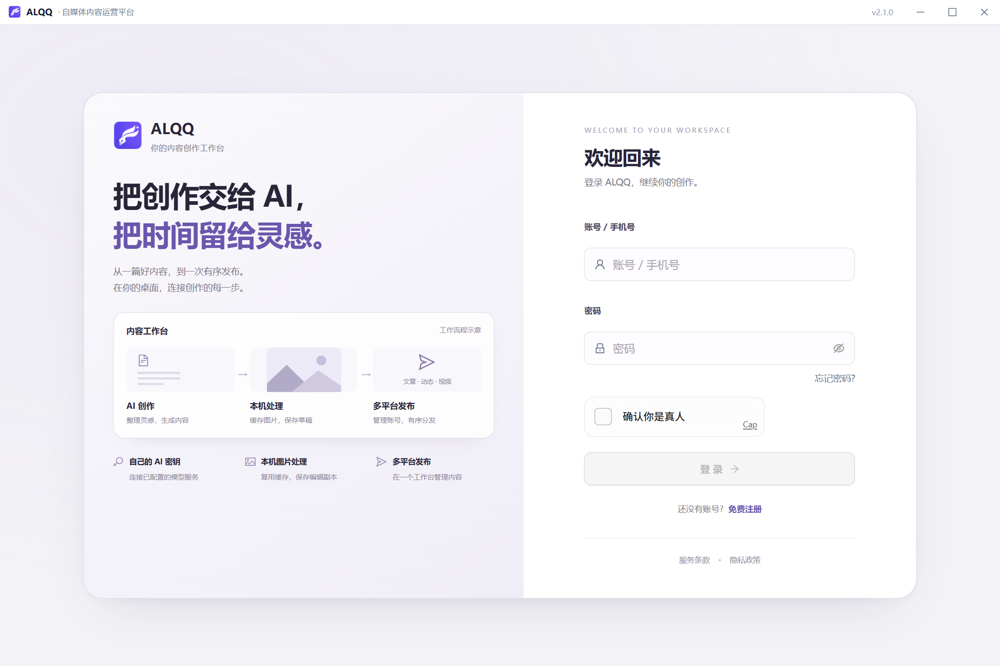

### AI 写作：从选题开始

选择热点、产品或自定义主题，再配置写作风格、篇幅与配图。

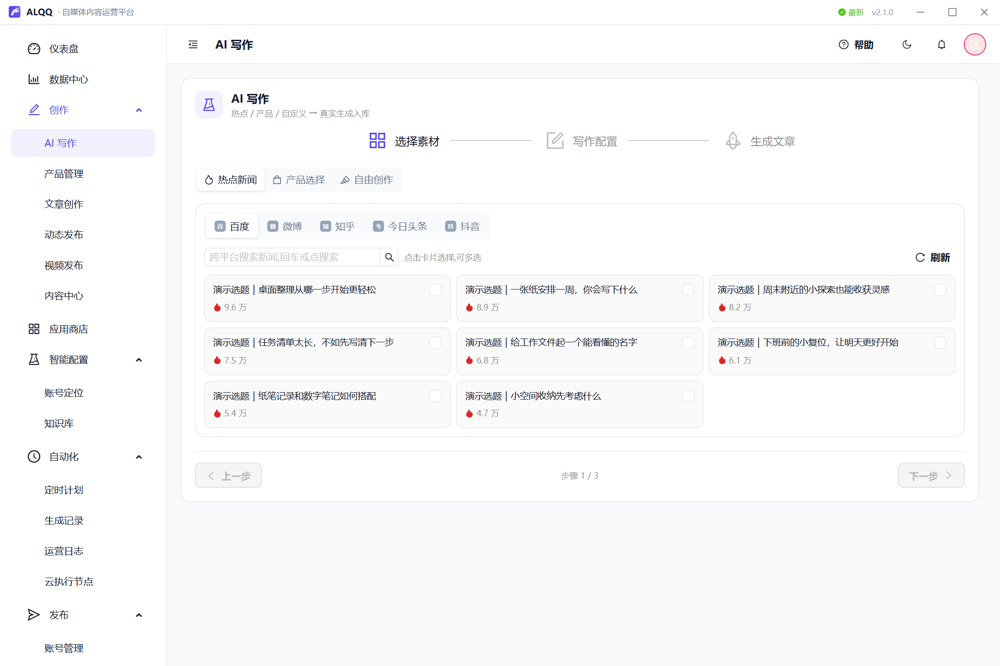

### 文章创作：编辑后再发布

在编辑器中调整正文与排版，按需改写、翻译或插入图片。

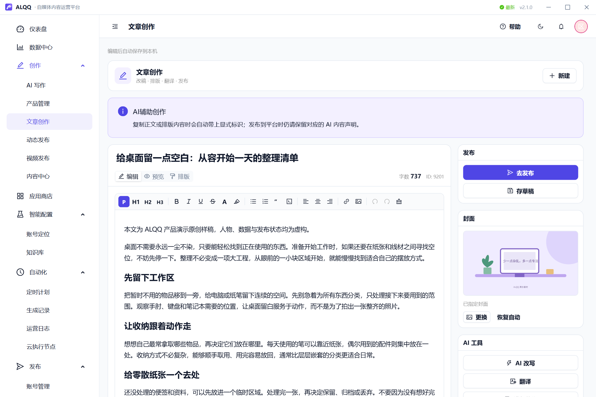

### 账号管理：账号与设置集中查看

查看各平台账号状态、分组和发布预设；需要重新登录时按提示处理。

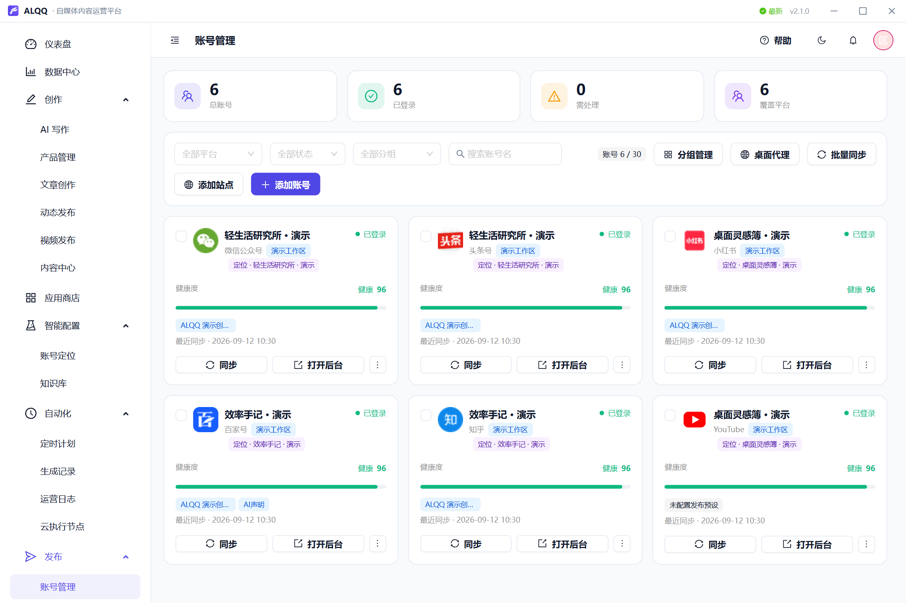

<details>
<summary><b>展开：运营概览与内容中心</b></summary>

#### 运营概览

查看生成、发布、账号和计划概况，以及近期发布记录。

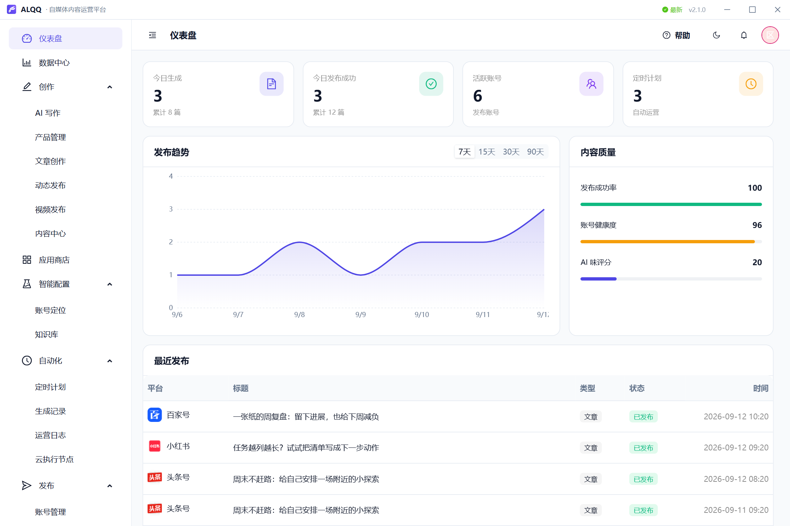

#### 内容中心

集中查看已有内容，打开预览、继续编辑或选择账号发布。

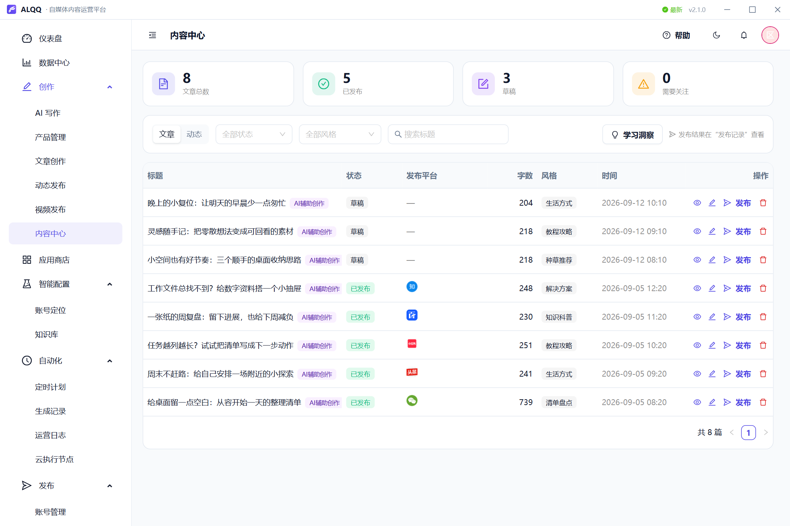

</details>

<details>
<summary><b>展开：定时计划与 YouTube 发布预设</b></summary>

#### 定时计划

管理周期、发布目标和启停状态；执行条件以计划设置与执行端状态为准。

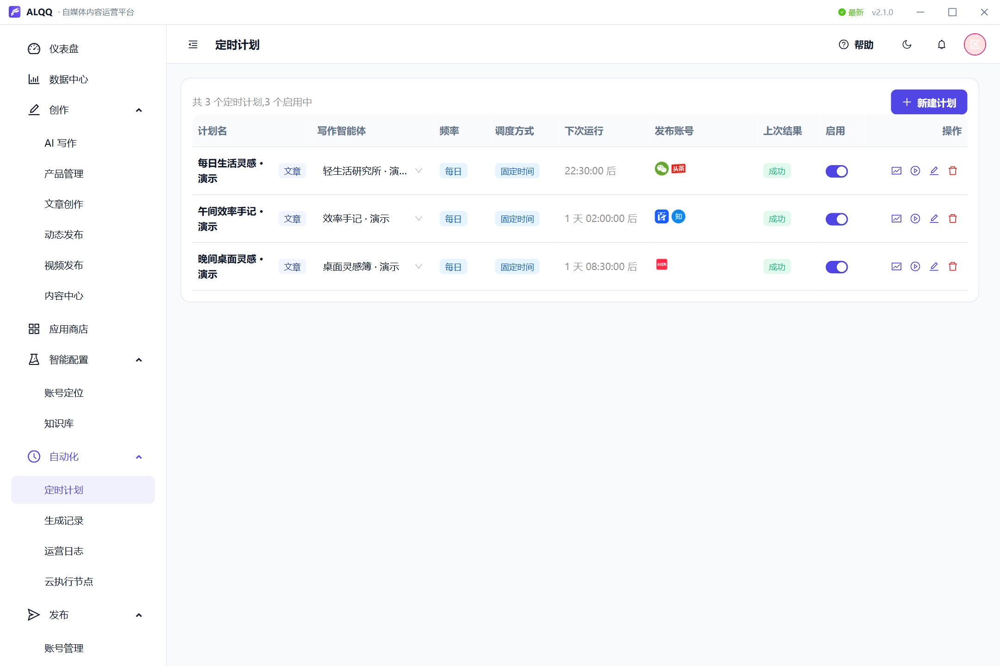

#### YouTube 发布预设

在账号发布设置中预设可见性、内容声明等选项，供桌面端视频发布使用。

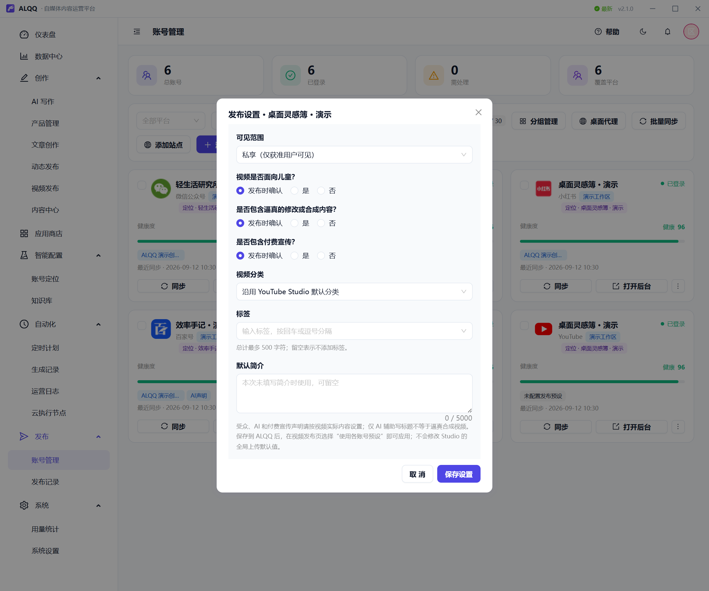

</details>

<details>
<summary><b>展开：账号定位、知识库与产品资料</b></summary>

#### 账号定位

维护内容方向、目标读者与写作要求，让不同账号各有侧重。

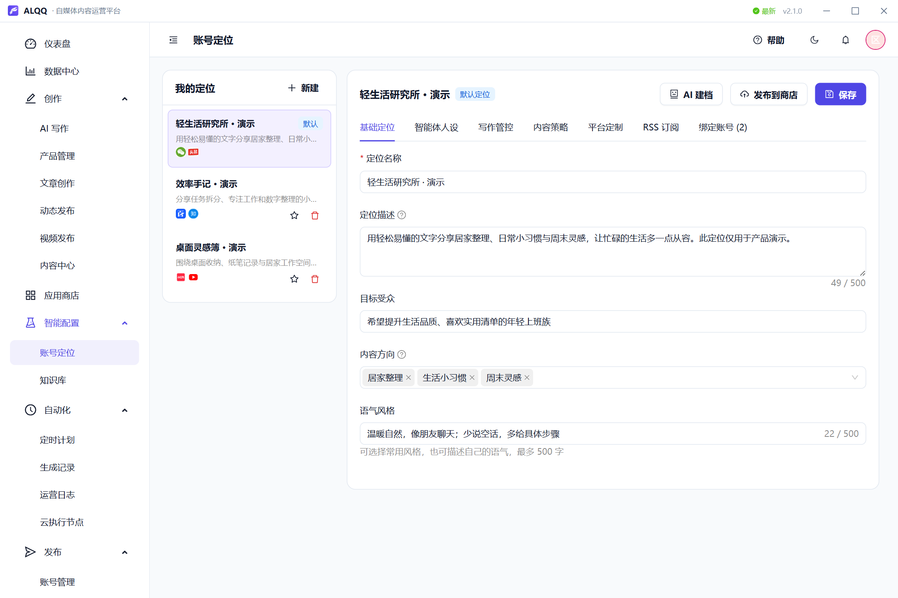

#### 知识库

整理可供写作参考的资料，并关联相应内容定位。

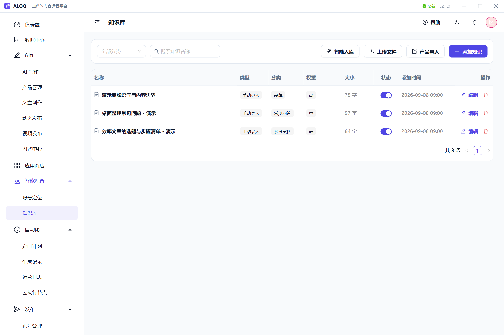

#### 产品管理

集中维护产品名称、卖点与图片，供内容创作时选用。

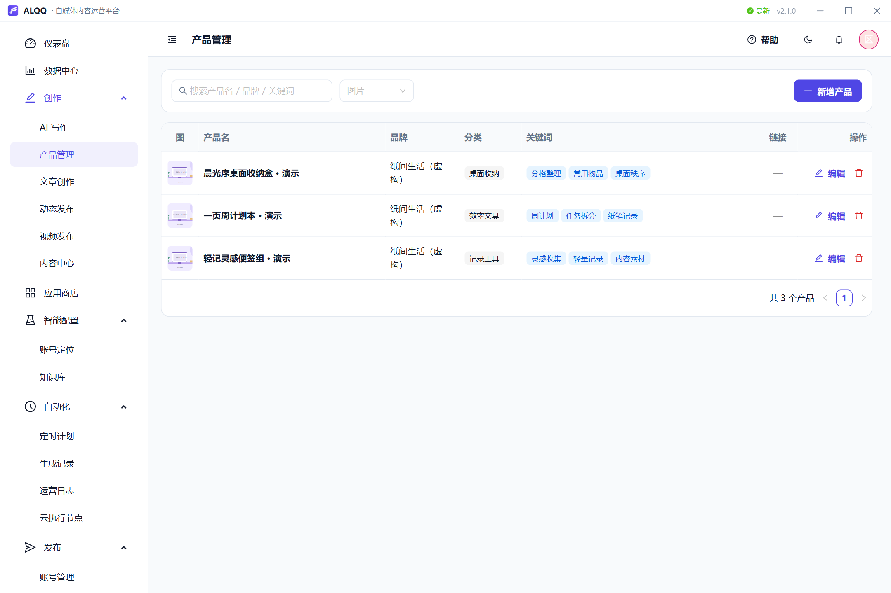

</details>

<details>
<summary><b>展开：AI 配置与本地存储</b></summary>

#### AI 配置

选择服务商和模型，按需填写自己的密钥；第三方服务费用另计。

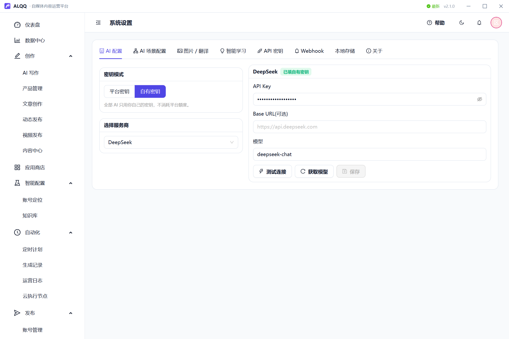

#### 本地存储

查看图片缓存和本机编辑副本，设置未使用缓存的保留天数与容量目标。

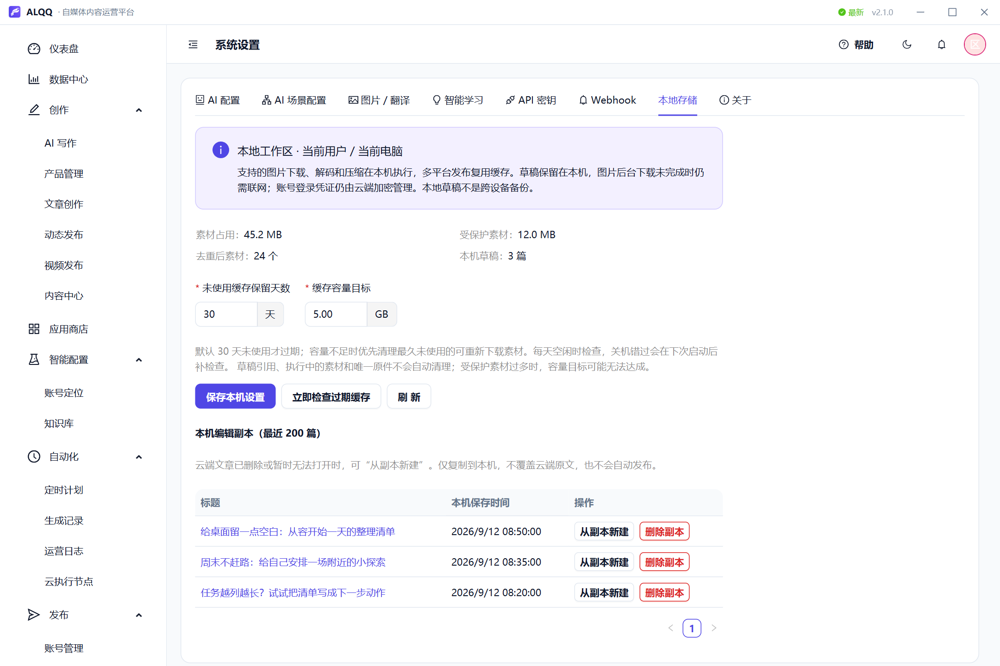

</details>

---

## 🆓 使用与费用

ALQQ 支持免费注册，桌面端可免费下载。

- 使用自己的 AI / 图片服务时，调用费用由对应服务商收取。
- 使用平台提供的模型、发布额度、账号数量、执行节点和 API 权限时，以控制台显示的套餐或授权为准。

可先[查看官网定价](https://www.alqq.cn/pricing)，再按自己的创作量选择。

---

## 🚀 支持的平台

当前接入 **22 个内容平台＋2 种站点系统**。各平台支持的内容类型和设置不同，发布页面会显示当前账号可用的选项。

| 资讯图文 | 短视频 | 社区 / 电商 | 海外平台 |
|---|---|---|---|
| 百家号 | 抖音 | 知乎 | TikTok |
| 今日头条 | 哔哩哔哩 | 小红书 | Instagram |
| 微信公众号 | 快手 | 豆瓣 | Facebook |
| 企鹅号 | 视频号 | 简书 | YouTube |
| 搜狐号 | | CSDN | |
| 大鱼号 | | | |
| 快传号 | | | |
| 微博 | | 淘宝光合 | |

**自有站点接入**：PbootCMS、InnoShop。

其中 **19 个平台支持视频发布，界面中的视频发布功能均仅支持 Windows 桌面端**，不是仅限 YouTube。网页端不提供视频发布；本地视频文件需使用桌面端。OpenAPI 的远程视频直链发布另有执行端要求，见下方说明。

**YouTube 发布预设**：登录 YouTube Studio 后，可预设可见性、儿童内容、标签、分类和描述等。

---

## ✨ 主要功能

### 内容创作与配图

- **选题与写作**：从热点、标题或自己的素材生成文章草稿，再编辑、审校。
- **文风与账号定位**：为账号设置人设、语气和写作风格，调整内容表达。
- **知识库与产品库**：导入 PDF、Word、Excel、TXT 或文本，整理参考资料与产品信息。
- **图片与 AI 生图**：组合使用产品图、图片服务和 AI 生图；桌面端支持本地图片处理与缓存。

### 发布与账号管理

- **文章分发与桌面端视频发布**：选择兼容平台和多个账号，减少重复填写、上传和排版；界面中的视频发布功能统一由 Windows 桌面端提供。
- **动态 / 微头条**：支持头条、百家号、抖音、搜狐、公众号和微博的短内容发布。
- **账号发布预设**：按平台保存封面、标签、可见性等常用设置。
- **任务记录**：查看发布进度、平台结果和失败原因；可能已经提交的任务先核查，再决定是否重试。

### 定时计划与运营

- **定时计划**：按可用执行端设置周期、时段和发布目标。
- **多账号管理**：统一管理平台账号和内容，同一账号的任务依次执行。
- **数据看板**：查看发布量、成功率、账号状态和用量。

发布时请保持执行端在线。账号登录、扫码保护和平台审核可能需要人工处理，实际完成时间也受内容准备和平台状态影响。发布前请核对内容事实和素材授权。

### AI 服务接入

支持 DeepSeek、硅基流动、智谱 AI、火山引擎、Cloudflare AI，以及兼容 OpenAI 协议的自建或第三方接口。可按功能选择服务商、密钥和模型，具体模型能力以对应服务为准。

---

## 🔌 开放 API

通过 API 调用文章生成、内容发布、发布记录及额度查询，可用于接入 n8n、Coze 或自有系统。使用前请确认账号具有相应权限。

**API 视频发布**：远程视频直链可通过 OpenAPI 交给已授权的 Linux 执行节点（`executor=edge`）执行，需同时满足节点实际能力、账号绑定与调用权限；不支持网页云执行（`executor=web`）。本地视频文件仍仅支持桌面端发布，YouTube 不支持节点执行。

接口与调用示例见 [在线 API 文档](https://alqq.cn/api/openapi/v1/reference)。

---

## 🖥️ 使用方式

| 使用方式 | 适合什么情况 | 发布在哪里执行 |
|---|---|---|
| **网页端** | 随时查看内容、管理账号和计划 | 根据账号绑定与权限，由可用执行端完成；云端任务共享调度资源，不支持视频发布 |
| **Windows 桌面端** | 日常创作、本机发布、使用自己的 AI / 图片服务 | 在你的电脑上执行，需要客户端在线 |
| **Linux 执行节点** | 不方便让个人电脑长期挂机 | 在你自己的服务器上执行，需要完成配对与授权；OpenAPI 远程视频直链发布另需满足节点能力、绑定与权限 |

**数据如何保存**：图片缓存与草稿可保存在本机；平台账号登录信息加密保存在主站，桌面端发布时按授权获取，不作为本地草稿或缓存保存。桌面端仍需联网使用账号、计划和所选 AI / 图片服务。

**多账号如何运行**：账号使用相互隔离的发布环境，同一账号的任务依次执行；隔离环境不会自动更换网络 IP，也需要遵守各平台规则。

---

## 📲 交流与反馈

使用中遇到问题，或有功能建议，欢迎加入交流群。**注册和下载安装包无需加群或添加微信**。

<table>
<tr>
<td align="center" width="33%">

### 👤 微信联系

**业精于勤**


加好友备注「**自媒体**」<br/>使用咨询 · 问题反馈 · 入群帮助

</td>
<td align="center" width="33%">

### 👥 微信群

**自媒体自动化运营**


扫码进群<br/>二维码失效时，可联系左侧微信获取邀请

</td>
<td align="center" width="33%">

### 🐧 QQ 群

**新媒体自动化运营 · 733861251**


扫码 或 [点击加群](https://qm.qq.com/q/2jRwOrOOYg)<br/>搜群号 **733861251** 也可加入

</td>
</tr>
</table>

---

## 📄 授权说明

ALQQ 是专有软件，个人可按许可免费使用，软件业务源码不公开。

本仓库提供产品介绍、截图、安装附件和节点部署示例，不包含 ALQQ 业务源码。许可范围与使用限制见 [LICENSE](LICENSE)；商业授权或合作可通过上方方式联系。

---

<div align="center">

## English

**ALQQ** helps creators and content teams write, illustrate and publish from one workspace.

Create article drafts from topics or reference material, adjust the writing style, add images, then publish to selected accounts. ALQQ also supports short posts, video uploads, account presets and scheduled tasks. Integrations cover **22 content platforms plus PbootCMS and InnoShop**; available content types vary by platform. **Video publishing is supported on 19 platforms. In the user interface, video publishing is available only in the Windows desktop app, not just for YouTube. Local video files require the desktop app.** YouTube account presets include visibility, audience, tags, category and description.

**OpenAPI video publishing:** remote video URLs can be submitted to an authorized Linux execution node (`executor=edge`), subject to the node's actual capabilities, account binding and API permissions. Web/cloud execution (`executor=web`) is not supported for video. YouTube remains desktop-only, including through the API.

Use the **web app** for content and account management, the **Windows desktop app** to publish from your own computer, or a **Linux execution node** for tasks on your own server.

**Desktop 2.1.0** introduces updated branding and login screens, supported AI / image requests over your computer's network, local image caching and draft recovery. Windows 10 / 11 x64 is required. Save your work and wait for publishing tasks to finish before upgrading with the **full installer**; a content hot update alone is not sufficient. [Download and release notes](https://github.com/zhuixin8/meiti-ai/releases/tag/v2.1.0).

Registration and desktop downloads are free. Your AI / image providers charge for their services; hosted resources and quotas depend on your ALQQ plan or permissions. Platform login credentials are encrypted on the ALQQ service and supplied to authorized desktop sessions when needed. Local drafts and image caches do not replace the online service. Login verification and platform reviews may require your attention.

**[Register](https://www.alqq.cn/register) or download directly — joining a chat group is optional.** The contacts above are available for questions and feedback. ALQQ is proprietary software; this repository contains product information and distribution resources, not its business source code. See [LICENSE](LICENSE).

<br/>

⭐ 觉得好用，欢迎 **Star** 支持！

</div>
