<div align="center">


# ALQQ 自媒体运营助手

### 一次创作，多平台分发 · Windows 桌面端 2.1.6

从选题、写作和配图，到多账号发布与定时计划，在一个工作台完成。

**ALQQ.CN · 自媒体内容创作与运营工作台**。让个人创作者、内容工作室和品牌运营团队少做重复搬运，把时间留给内容。

[](#-使用与费用)
[](#-支持的平台)
[](https://www.alqq.cn/download/desktop)
[](LICENSE)

### 📥 [官网下载 Windows 桌面端 2.1.6（推荐）](https://www.alqq.cn/download/desktop)

[Microsoft Store 下载](https://apps.microsoft.com/detail/9P75HV6KJV0N?hl=zh-CN&gl=CN) ｜ [GitHub 备用下载](https://github.com/zhuixin8/meiti-ai/releases/download/v2.1.6/ALQQ_2.1.6_x64-setup.exe)

优先从官网下载，获取当前官网版及安装说明；也可选择微软商店安装。两个渠道分别更新，请选择一个，不要互相覆盖安装。

Windows 10 / 11 x64 · 约 190.2 MiB · [更新与校验说明](RELEASE-2.1.6.md) · [开发进度](DEVELOPMENT.md)

更新日期：2026-10-08。当前公开桌面版仍为 2.1.6；最新 2.1.7 为待安装验收候选，未推送全体用户。后端、Web 和受控 Linux 节点已完成本批更新；商店按独立流程更新，实际可下载版本以页面为准。

[官网](https://www.alqq.cn/) · [免费注册](https://www.alqq.cn/register) · [功能介绍](#-主要功能) · [交流与反馈](#-交流与反馈)

</div>

---


## 2026-10-08 开发与部署进展

本批后端、Web 和美国受控执行节点已更新并复测；**最新 Windows 2.1.7 完整候选已生成，更新器签名与内容完整性通过，但安装验收尚未完成**。官网下载、GitHub 公开 Release 和更新指针保持 2.1.6，不用候选覆盖正式包。

| 方向 | 本批完成与边界 |
| --- | --- |
| 发布设置 | 图文、视频、动态独立预设；版本化目录管理分类和声明，账号预设、视频页和 API 共用契约 |
| 下拉分类 | 可内置选项直接选择；搜狐视频一级/二级频道联动，不复用文章分类或自动替换选择 |
| 自定义封面 | 视频封面放在右侧摘要；按任务采用用户选择，未接入或不能确认采用时停止，不静默换自动封面 |
| 平台与网络 | 搜狐适配、页面就绪和代理隔离更新；超时、限流、登录和人工验证分别处理 |
| OpenAPI | 设置发现、只读预检、严格字段/分类校验、冻结队列设置，后续改预设不覆盖已创建任务 |
| 后台测试 | 独立隐藏原生链路回归，不依赖鼠标或用户窗口；真实发布测试默认关闭，仅受控开发者管理员逐项确认 |
| Linux 节点 | 受控节点 Agent 1.2.1 已更新；公开安装入口仍为 Edge 1.1.8，不代表全部节点已升级 |

本批后端 7,653 项通过、356 项跳过，前端 1,334 项、隔离 UI 259 项、原生后台 281 项、打包 sidecar 7 项通过。线上预检和节点隔离回归通过，**本轮没有上传或发布作品，不等于所有平台真实设置、封面和发布全部验收**。B 站限流、YouTube 完整页面、真实代理及安装环境仍需复测；条件性来源、拍摄信息和部分高级设置暂缓。

见 [开发进度](DEVELOPMENT.md) 与 [2.1.7 候选说明](RELEASE-2.1.7-CANDIDATE.md)。相关桌面功能需要对应的新完整包，不会仅因 Web 上线就出现在当前公开 2.1.6 内。

## 2026-10-04 公开版维护记录

**Windows 官网版 2.1.6 已正式发布**，GitHub 和官网安装包一致，完整下载、SHA-256 与更新器签名已核对；覆盖安装、自动登录、手动关闭百家号登录窗口后不再重弹、四个紧凑计划入口已有本批验收记录，用户也确认同机卸载后重新安装正常。

本版改善桌面会话确认与重连、账号切换隔离、本机扫描回执恢复、安装前草稿保存及 Windows 用户级凭据保护；正常连接不再占用整块提示区域。官网版通过 ALQQ 更新，商店版通过 Microsoft Store 更新，请选择一个渠道安装，不用官网 EXE 覆盖商店版。

微软商店中国区已有产品页面。原 2.1.6.0 更新已取消认证并返回草稿；**ALQQ.CN 新品牌 MSIX 已在本地准备，尚未上传或重提**。账号验证正在进行，产品身份页仍显示旧发布者 ALQQ.cc，待名称同步后再校验提交；已上架版本不受本次撤回影响。具体校验与边界见 [2.1.6 发布说明](RELEASE-2.1.6.md) 和 [开发进度](DEVELOPMENT.md)。

## 💡 ALQQ 能做什么

**ALQQ** 为个人创作者、内容工作室和品牌运营团队提供内容创作与多平台发布工具。你可以根据热点或自己的选题生成文章，结合产品资料和知识库配图、调整文风，再把文章、动态发布到选定账号；界面中的视频发布入口统一在 Windows 桌面端使用。

Windows 桌面端使用你的电脑和网络完成浏览器发布；网页端方便管理内容、账号与计划；Linux 执行节点适合需要长期在线的自托管任务。三种方式共用 ALQQ 账号和业务数据。

### 选择下载渠道

| 渠道 | 入口 | 更新方式 |
| --- | --- | --- |
| **官网下载（推荐）** | [下载 Windows 桌面端](https://www.alqq.cn/download/desktop) | 由 ALQQ 提供官网版更新 |
| Microsoft Store | [商店应用页面](https://apps.microsoft.com/detail/9P75HV6KJV0N?hl=zh-CN&gl=CN) | 由微软商店分发审核通过的版本，可能晚于官网 |
| GitHub 备用 | [2.1.6 Release](https://github.com/zhuixin8/meiti-ai/releases/tag/v2.1.6) | 备用安装包与校验资料 |

桌面端免费下载安装；账号套餐、平台 AI 和其他服务仍按现有规则收费。商店尚在审核的更新不等于已可下载。

### 开始使用

1. [注册 ALQQ 账号](https://www.alqq.cn/register)，优先从[官网下载桌面端](https://www.alqq.cn/download/desktop)并登录，或先使用网页端。
2. 在「账号管理」中添加平台账号，并按页面提示完成扫码或浏览器登录。
3. 配置自己的 AI / 图片服务，或使用套餐允许的平台资源；创建内容、检查预览后，选择账号发布。

注册和下载不需要添加微信。需要帮助时，可通过文末的交流群反馈。

---

## 🆕 桌面端 2.1.6

这一版继续使用 **ALQQ 自媒体运营助手** 中文名称，重点改善本机会话、账号登录取消、紧凑计划入口与发布诊断，同时保留账号同步、外部连接和发布结果核验改进。官网与 GitHub 提供同一份已验收、经过完整下载和更新器签名校验的安装包。

| 升级点 | 说明 |
|---|---|
| **桌面会话更可靠** | 合并身份准备请求，重连和切换账号时隔离旧会话结果 |
| **关闭即取消登录** | 手动关闭平台登录窗口后不自动重新弹出，取消不误报浏览器故障 |
| **正常状态更安静** | 本机连接正常时不再显示大块就绪提示，异常仍提供恢复入口 |
| **四个紧凑计划入口** | AI 文章、Word 供稿、图文动态、已有视频并列选择，能力以套餐和执行端为准 |
| **中文名称与升级兼容** | 保留原有程序标识和升级路径；发布者显示名称统一为 ALQQ.CN 的流程正在进行 |
| **账号同步更明确** | 合并重复的批量同步入口，按已选账号或当前筛选操作 |
| **更紧凑的设置页** | 优化外部连接额度摘要、连接详情和本地存储布局 |
| **发布前检查** | 外部工具可按授权查询身份、桌面与引擎状态；执行前仍检查账号、媒体和额度 |
| **结果核验保护** | 未知结果先查询，不自动重发；加强人工核验后的状态保护和调用来源分类 |
| **覆盖安装修复** | 避免同版本覆盖安装后仍被遗留前端副本遮蔽新界面 |

**系统要求**：Windows 10 / 11 x64。安装包包含发布所需运行环境；缺少 Microsoft WebView2 时，请按安装器提示安装。桌面端不支持 Windows 7 / 8。

**已有用户升级**：保存编辑、等待发布任务结束，再通过「设置 → 关于 → 检查更新」或退出 ALQQ 后运行完整安装包。**2.1.6 需要完整升级，旧版内容热更新不能替代安装包**。无需先卸载旧版，请保留用户数据目录；已安装本次最终 2.1.6 包的用户无需重复安装。同版本早期测试包请按发布说明的 SHA-256 核对。

普通用户下载 `.exe` 即可。详细日志、签名与文件校验见 [2.1.6 发布说明](RELEASE-2.1.6.md)。官网版和商店版分别更新，不用商店上传 MSIX 覆盖官网版。

### 开发与上架进度

| 项目 | 当前状态 |
| --- | --- |
| Windows 官网版 2.1.6 | 官网和 GitHub 已公开发布，更新入口已启用 |
| Windows 候选 2.1.7 | 最新完整包生成、更新器/内容签名校验通过；待安装验收，未公开推送 |
| Web 与配套服务 | 发布设置目录、API 契约与后台验收配套已更新，线上复测通过 |
| WorkBuddy / 豆包连接 | 自定义 OAuth 接入、供稿、查询与去重可按权益使用；不是官方市场上架声明 |
| 连接器发布 | 提出请求后在 ALQQ 人工确认；直接发布仍未开放，MCP 定时未开放 |
| Microsoft Store | 中国区已有产品页面；更新已撤回至草稿，新品牌包待发布者验证和重提 |
| WorkBuddy 创作专家 | 仍在完善和回归，暂缓市场提交 |

后续计划与测试范围见 [开发进度](DEVELOPMENT.md)，不将待办写成已完成功能。

---

## 🐳 Linux / 宝塔执行节点

不想让 Windows 电脑长期挂机时，可以在自己的 Linux 服务器或宝塔 Docker 中安装执行节点。先在 Windows 桌面端完成平台账号登录，再将支持托管的账号绑定到节点。OpenAPI 视频使用实际执行端已有的本地文件，新节点能力与目录要求见下方「开放 API」。

账号、计划、内容与日志统一在 [ALQQ 主站](https://www.alqq.cn/) 管理；节点需要对应套餐或授权。

当前公开更新入口：[**Edge 1.1.8**](https://github.com/zhuixin8/meiti-ai/releases/tag/edge-v1.1.8)，支持 **Linux x64（amd64）**。本轮不再推进 Linux ARM64 适配，请勿向 ARM64 机器安装 amd64 包。Edge 与 Windows 桌面端分别安装、分别升级；Windows 安装包不用于 Linux 节点。

<details>
<summary>安装与日常管理</summary>

### 一键安装

1. 登录主站，进入「自动化 → 执行节点」，创建一个 15 分钟有效的一次性配对码。
2. 在宝塔终端或 Linux SSH 中运行：

```bash
curl -fsSL https://github.com/zhuixin8/meiti-ai/releases/download/edge-v1.1.8/install-edge.sh -o install-edge.sh
# 阅读脚本并确认服务器架构、来源和安装范围后再执行
sudo bash install-edge.sh
```

3. 按提示输入配对码，回到主站把需要托管的账号绑定到该节点。

请先阅读安装脚本，并在自己的服务器上执行。安装器会选择对应架构、下载和校验文件；仓库中的 Compose 文件仅作为示例，首次安装请使用上述安装器。

### 常用运维

```bash
cd /opt/alqq-edge
docker compose ps
docker compose logs -f --tail 100
docker compose restart
```

</details>

---

## 🖼️ 界面预览

以下保留 **2.1.0 正式版前端**的演示截图，不冒充 2.1.6 新界面；账号同步、连接详情等布局以当前程序为准。截图使用虚构演示数据，不包含真实用户账号、文章或密钥。统计、热点及任务状态不代表实际运营结果。点击图片可查看大图。

### 新版桌面登录

统一品牌与登录入口，进入自己的内容工作台。

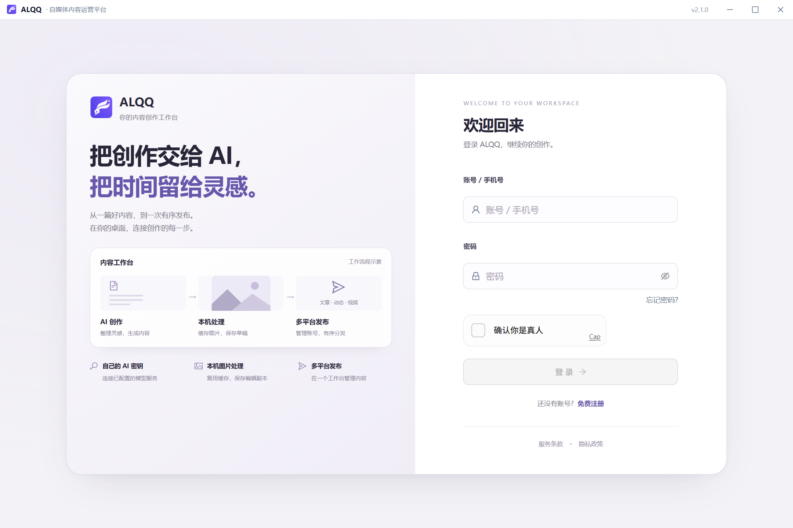

### AI 写作：从选题开始

选择热点、产品或自定义主题，再配置写作风格、篇幅与配图。

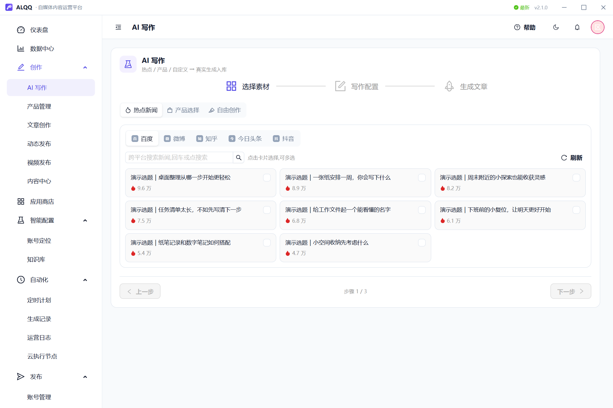

### 文章创作：编辑后再发布

在编辑器中调整正文与排版，按需改写、翻译或插入图片。

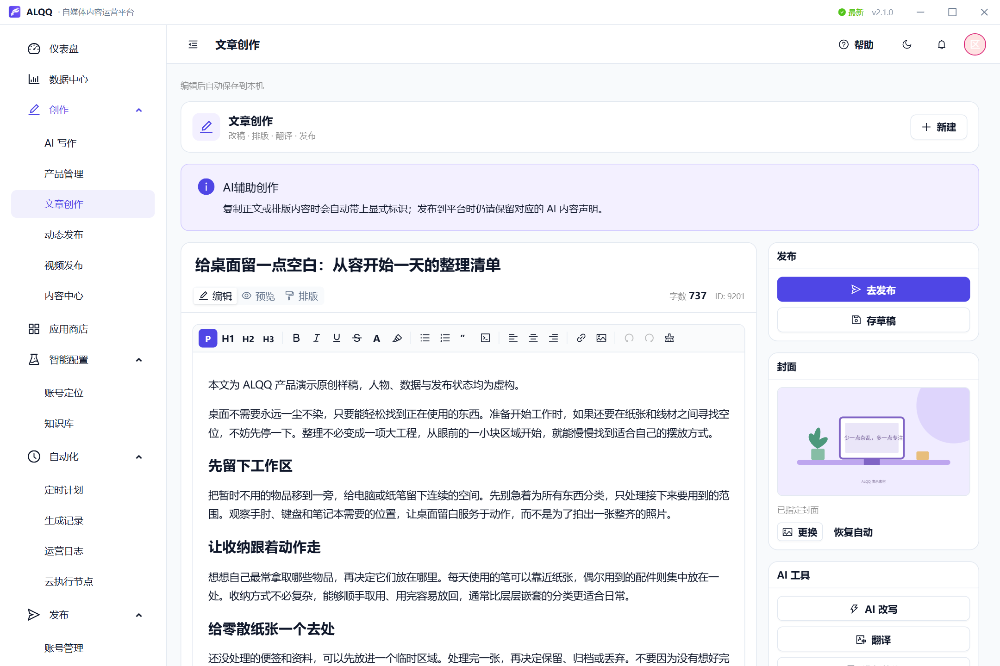

### 账号管理：账号与设置集中查看

查看各平台账号状态、分组和发布预设；需要重新登录时按提示处理。

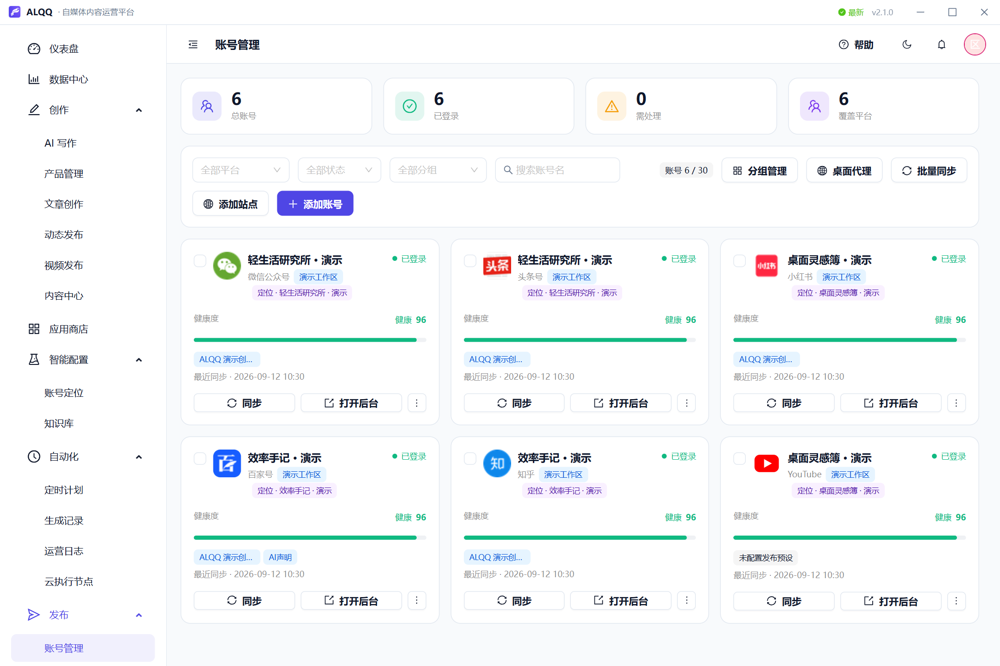

<details>
<summary><b>展开：运营概览与内容中心</b></summary>

#### 运营概览

查看生成、发布、账号和计划概况，以及近期发布记录。

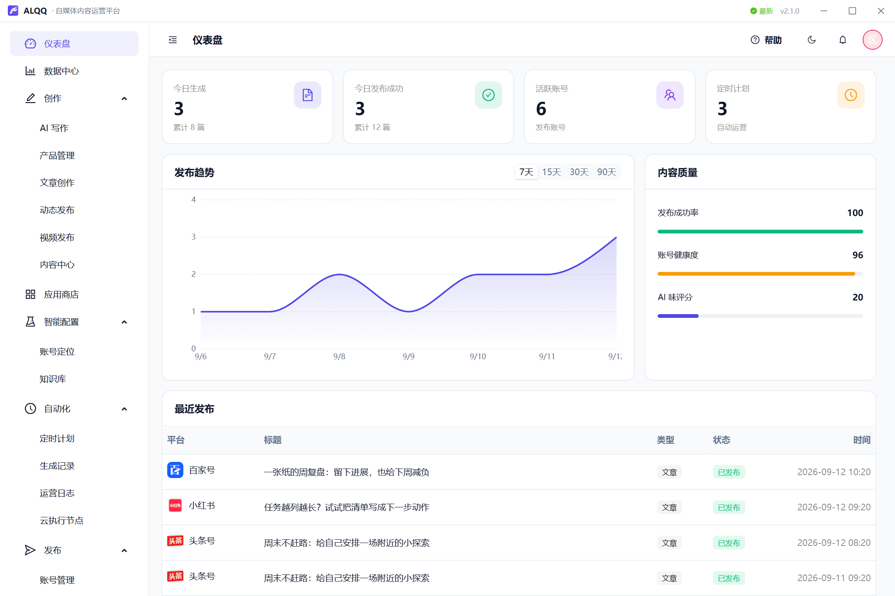

#### 内容中心

集中查看已有内容，打开预览、继续编辑或选择账号发布。

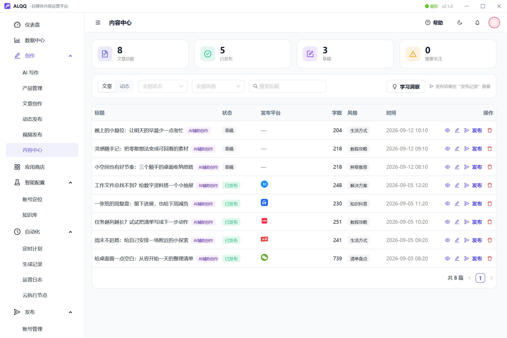

</details>

<details>
<summary><b>展开：定时计划与 YouTube 发布预设</b></summary>

#### 定时计划

管理周期、发布目标和启停状态；执行条件以计划设置与执行端状态为准。

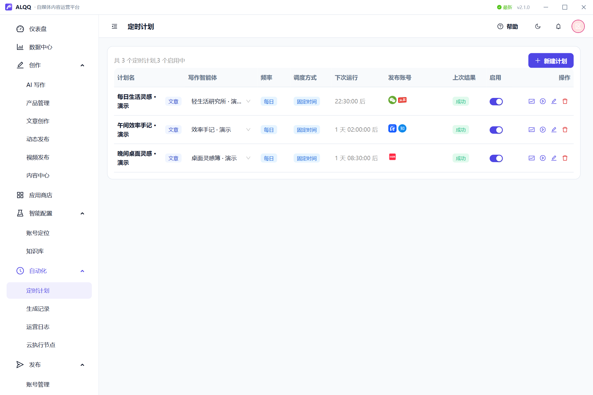

#### YouTube 发布预设

在账号发布设置中预设可见性、内容声明等选项，供桌面端视频发布使用。

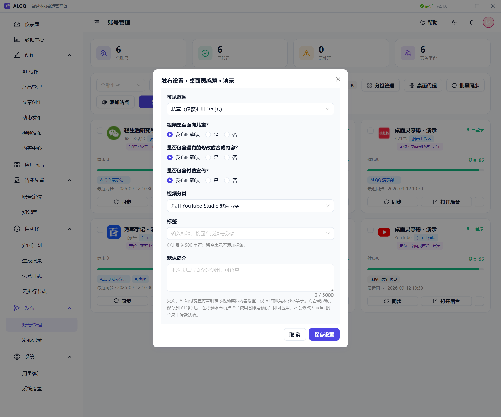

</details>

<details>
<summary><b>展开：账号定位、知识库与产品资料</b></summary>

#### 账号定位

维护内容方向、目标读者与写作要求，让不同账号各有侧重。

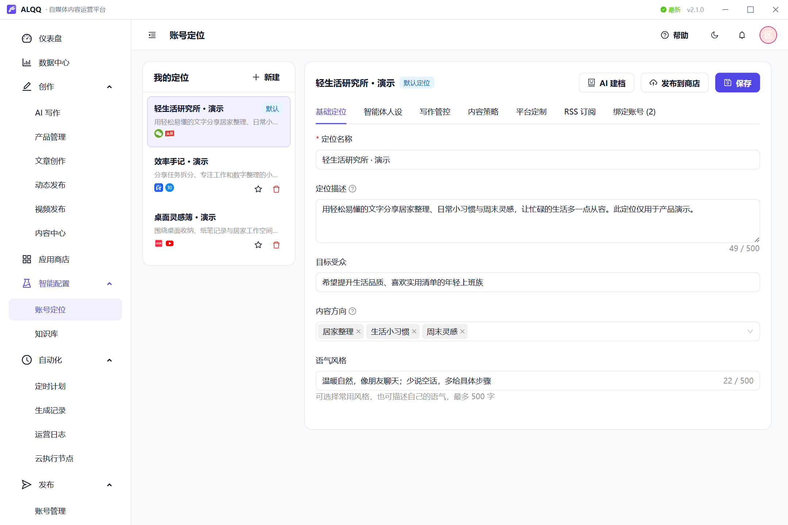

#### 知识库

整理可供写作参考的资料，并关联相应内容定位。

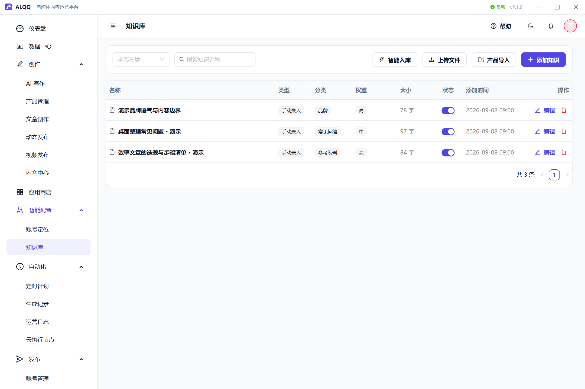

#### 产品管理

集中维护产品名称、卖点与图片，供内容创作时选用。

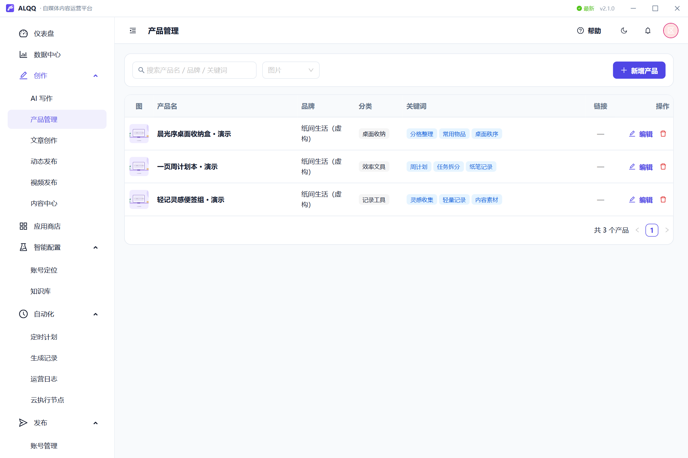

</details>

<details>
<summary><b>展开：AI 配置与本地存储</b></summary>

#### AI 配置

选择服务商和模型，按需填写自己的密钥；第三方服务费用另计。

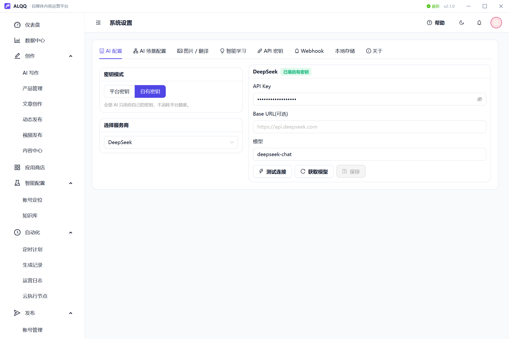

#### 本地存储

查看图片缓存和本机编辑副本，设置未使用缓存的保留天数与容量目标。

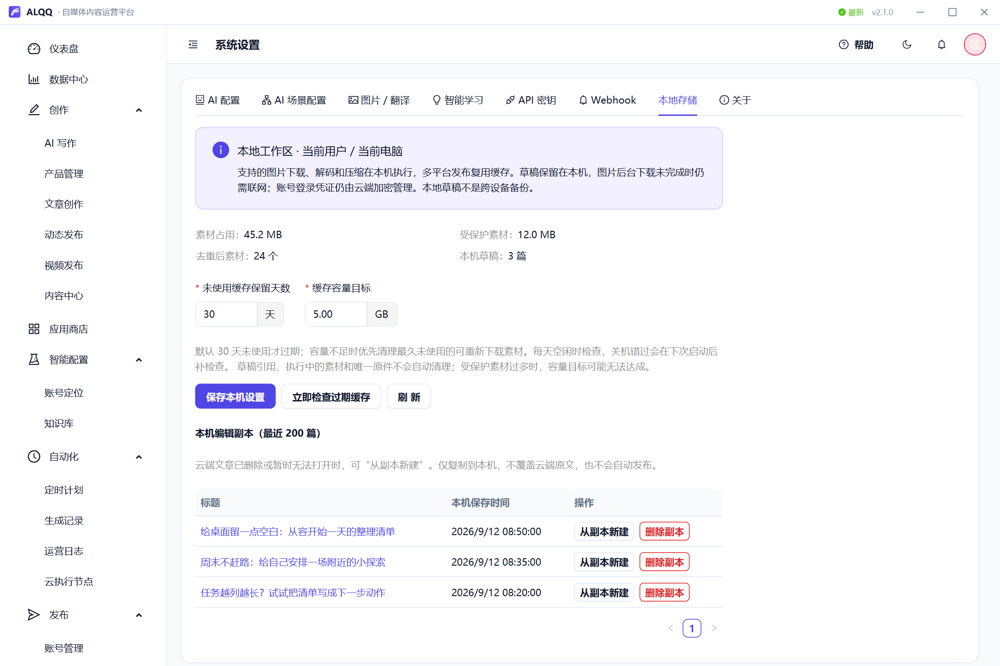

</details>

---

## 🆓 使用与费用

ALQQ 支持免费注册，桌面端可免费下载。

- 使用自己的 AI / 图片服务时，调用费用由对应服务商收取。
- 使用平台提供的模型、发布额度、账号数量、执行节点和 API 权限时，以控制台显示的套餐或授权为准。

可先[查看官网定价](https://www.alqq.cn/pricing)，再按自己的创作量选择。

---

## 🚀 支持的平台

当前接入 **22 个内容平台＋2 种站点系统**。各平台支持的内容类型和设置不同，发布页面会显示当前账号可用的选项。

| 资讯图文 | 短视频 | 社区 / 电商 | 海外平台 |
|---|---|---|---|
| 百家号 | 抖音 | 知乎 | TikTok |
| 今日头条 | 哔哩哔哩 | 小红书 | Instagram |
| 微信公众号 | 快手 | 豆瓣 | Facebook |
| 企鹅号 | 视频号 | 简书 | YouTube |
| 搜狐号 | | CSDN | |
| 大鱼号 | | | |
| 快传号 | | | |
| 微博 | | 淘宝光合 | |

**自有站点接入**：PbootCMS、InnoShop。

其中 **19 个平台支持视频发布，界面中的视频发布功能均仅支持 Windows 桌面端**，不是仅限 YouTube。网页端不提供视频发布；OpenAPI 可调度具备相应能力的桌面或节点本地文件。支持清单不代表全部账号、设置、封面均已实测通过。

**YouTube 发布预设**：登录 YouTube Studio 后，可预设可见性、儿童内容、标签、分类和描述等。

---

## ✨ 主要功能

### 内容创作与配图

- **选题与写作**：从热点、标题或自己的素材生成文章草稿，再编辑、审校。
- **文风与账号定位**：为账号设置人设、语气和写作风格，调整内容表达。
- **知识库与产品库**：导入 PDF、Word、Excel、TXT 或文本，整理参考资料与产品信息。
- **图片与 AI 生图**：组合使用产品图、图片服务和 AI 生图；桌面端支持本地图片处理与缓存。

### 发布与账号管理

- **文章分发与桌面端视频发布**：选择兼容平台和多个账号，减少重复填写、上传和排版；界面中的视频发布功能统一由 Windows 桌面端提供。
- **动态 / 微头条**：支持头条、百家号、抖音、搜狐、公众号和微博的短内容发布。
- **账号发布预设**：最新开发版按图文、视频、动态分别保存分类、标签、可见性和声明，本次覆盖不改变长期预设。
- **任务记录**：查看发布进度、平台结果和失败原因；可能已经提交的任务先核查，再决定是否重试。

### 定时计划与运营

- **定时计划**：按可用执行端设置周期、时段和发布目标。
- **多账号管理**：统一管理平台账号和内容，同一账号的任务依次执行。
- **数据看板**：查看发布量、成功率、账号状态和用量。

发布时请保持执行端在线。账号登录、扫码保护和平台审核可能需要人工处理，实际完成时间也受内容准备和平台状态影响。发布前请核对内容事实和素材授权。

### AI 服务接入

支持 DeepSeek、硅基流动、智谱 AI、火山引擎、Cloudflare AI，以及兼容 OpenAI 协议的自建或第三方接口。可按功能选择服务商、密钥和模型，具体模型能力以对应服务为准。

---

## 🔗 WorkBuddy / 豆包外部连接

在外部工具中创作，再经授权送入 ALQQ 云端草稿，继续检查和发布，无需手动搬运整篇文字。

1. 在 ALQQ「系统设置 → 外部连接 → 添加连接」选择对应客户端，复制当前环境的连接配置。
2. 在 WorkBuddy 或豆包桌面端添加自定义连接，通过 ALQQ 官方授权页登录并核对权限；不要把密码、验证码或 Token 发到聊天。
3. 先检查连接，再按需要校验和保存草稿。同一外部稿件标识与版本原样重试可返回原回执，避免重复入库。
4. 若已具备确认发布能力，先检查发布条件，再提出请求，由本人在 ALQQ 核对稿件、账号和执行端后确认。

**使用边界**：外部连接的权益、名额和调用量与普通 OpenAPI 分开；以账号实际权益和当前工具返回能力为准。草稿导入不会自动发布。桌面执行需要本人已授权的 ALQQ 桌面在线且引擎可用，预检通过也不保证平台审核通过。结果未知时查询原回执，不换标识反复提交。

当前直接发布、MCP 定时与持续供稿未开放。自定义连接不代表 WorkBuddy / 豆包官方合作或连接器市场上架；创作专家也仍待独立验收。外部工具保存的本机图片路径不能由远程 MCP 自动读取，须使用受支持的附件或图片链接方式。

## 🔌 开放 API

通过 API 调用文章生成、内容发布、发布记录及额度查询，可用于接入 n8n、Coze 或自有系统。使用前请确认账号具有相应权限。

**发布设置 API**：先按文章、动态或视频发现当前字段、分类和契约版本，再进行只读预检；账号预设和本次覆盖分别处理，任务使用冻结设置。预检不上传、不发表作品，也不保证平台审核通过。

**API 视频发布**：只接受实际执行端已经存在的 `localVideoPath`，不提供远程视频直链下载；封面使用本地 `coverImagePath`，非空 `videoUrl` / `coverImageUrl` 明确拒绝。默认由本人在线桌面执行；Linux 节点必须具备新版文件能力、专用视频目录、账号绑定及调用权限。公开 Edge 1.1.8 不能仅凭版本名视为满足新能力。调用方电脑路径不能当作远程节点路径。YouTube 仍仅限桌面，`executor=web` 不支持视频。

字段、限制和示例以 [在线 API 文档](https://www.alqq.cn/api-docs) 与 [接口参考](https://www.alqq.cn/api/openapi/v1/reference)为准，旧直链示例不再作为当前契约。

---

## 🖥️ 使用方式

| 使用方式 | 适合什么情况 | 发布在哪里执行 |
|---|---|---|
| **网页端** | 随时查看内容、管理账号和计划 | 根据账号绑定与权限，由可用执行端完成；云端任务共享调度资源，不支持视频发布 |
| **Windows 桌面端** | 日常创作、本机发布、使用自己的 AI / 图片服务 | 在你的电脑上执行，需要客户端在线 |
| **Linux 执行节点** | 不方便让个人电脑长期挂机 | 在自己的服务器执行；API 视频需新版能力、专用本地文件目录、绑定与授权 |

**macOS 状态**：Mac 安装包仍处于可行性评估，尚未发布，也未完成 macOS 实机验收；当前 Windows 安装包不能安装到 Mac。Linux 节点的 ARM64 限制与苹果芯片 Mac 的适配是两件不同的事。

**发布者名称**：品牌与官网统一为 **ALQQ.CN / https://www.alqq.cn/**。微软账号的名称变更正在验证，商店页面或旧安装包暂时仍可能显示 `ALQQ.cc`；现有技术包标识保留以延续安装和更新，不代表官网地址改成了 `.cc`。

**数据如何保存**：图片缓存与草稿可保存在本机；平台账号登录信息加密保存在主站，桌面端发布时按授权获取，不作为本地草稿或缓存保存。桌面端仍需联网使用账号、计划和所选 AI / 图片服务。

**多账号如何运行**：账号使用隔离的发布环境，同账号任务依次执行。最新开发版按账号覆盖或用户默认配置平台代理，配置失败不静默直连；普通业务/AI 请求不全局套用账号代理。代理入口不保证固定公网 IP，“无感切换”不保证上传不中断或避免封禁，仍须遵守平台规则。

---

## 📲 交流与反馈

使用中遇到问题，或有功能建议，欢迎加入交流群。**注册和下载安装包无需加群或添加微信**。

<table>
<tr>
<td align="center" width="33%">

### 👤 微信联系

**业精于勤**


加好友备注「**自媒体**」<br/>使用咨询 · 问题反馈 · 入群帮助

</td>
<td align="center" width="33%">

### 👥 微信群

**自媒体自动化运营**


扫码进群<br/>二维码失效时，可联系左侧微信获取邀请

</td>
<td align="center" width="33%">

### 🐧 QQ 群

**新媒体自动化运营 · 733861251**


扫码 或 [点击加群](https://qm.qq.com/q/2jRwOrOOYg)<br/>搜群号 **733861251** 也可加入

</td>
</tr>
</table>

---

## 📄 授权说明

ALQQ 是专有软件，个人可按许可免费使用，软件业务源码不公开。

本仓库提供产品介绍、截图、安装附件和节点部署示例，不包含 ALQQ 业务源码。许可范围与使用限制见 [LICENSE](LICENSE)；商业授权或合作可通过上方方式联系。

---

<div align="center">

## English

**ALQQ** helps creators and content teams write, illustrate and publish from one workspace.

Create article drafts from topics or reference material, adjust the writing style, add images, then publish to selected accounts. ALQQ also supports short posts, video uploads, account presets and scheduled tasks. Integrations cover **22 content platforms plus PbootCMS and InnoShop**; available content types vary by platform. **Video publishing is supported on 19 platforms. In the user interface, video publishing is available only in the Windows desktop app, not just for YouTube. Local video files require the desktop app.** YouTube account presets include visibility, audience, tags, category and description.

**OpenAPI video publishing:** remote video URLs can be submitted to an authorized Linux execution node (`executor=edge`), subject to the node's actual capabilities, account binding and API permissions. Web/cloud execution (`executor=web`) is not supported for video. YouTube remains desktop-only, including through the API.

Use the **web app** for content and account management, the **Windows desktop app** to publish from your own computer, or a **Linux execution node** for tasks on your own server.

**Desktop 2.1.6** is publicly available under the Chinese display name **ALQQ 自媒体运营助手**. It improves desktop session readiness, login cancellation, compact scheduling entries, account synchronization and publishing-result verification. Windows 10 / 11 x64 is required. Save your work and wait for publishing tasks to finish before using the **full installer**. [Download from the official website (recommended)](https://www.alqq.cn/download/desktop), [Microsoft Store](https://apps.microsoft.com/detail/9P75HV6KJV0N?hl=zh-CN&gl=CN), or [release notes and GitHub mirror](RELEASE-2.1.6.md). Choose one installation channel; do not install one over the other.

WorkBuddy and Doubao can connect through user-authorized OAuth for draft submission and receipt queries, subject to ALQQ entitlements. Publishing requests require review in ALQQ; direct and scheduled MCP publishing are not currently open. The Microsoft Store product page is available for China; the previous 2.1.6.0 certification has been canceled and returned to draft. A local **ALQQ.CN** MSIX candidate is prepared, but has not been uploaded or resubmitted. Additional account verification is still in progress, and the product identity page still requires the former publisher display name. The existing Store release remains available. The WorkBuddy creative expert remains under validation. See [development status](DEVELOPMENT.md).

Registration and desktop downloads are free. Your AI / image providers charge for their services; hosted resources and quotas depend on your ALQQ plan or permissions. Platform login credentials are encrypted on the ALQQ service and supplied to authorized desktop sessions when needed. Local drafts and image caches do not replace the online service. Login verification and platform reviews may require your attention.

**Official website: [ALQQ.CN](https://www.alqq.cn/).** Windows desktop and Linux x64 node packages are available; no macOS installer has been released or validated. Linux ARM64 adaptation is not being pursued in this release cycle.

**[Register](https://www.alqq.cn/register) or download directly — joining a chat group is optional.** The contacts above are available for questions and feedback. ALQQ is proprietary software; this repository contains product information and distribution resources, not its business source code. See [LICENSE](LICENSE).

<br/>

⭐ 觉得好用，欢迎 **Star** 支持！

</div>
